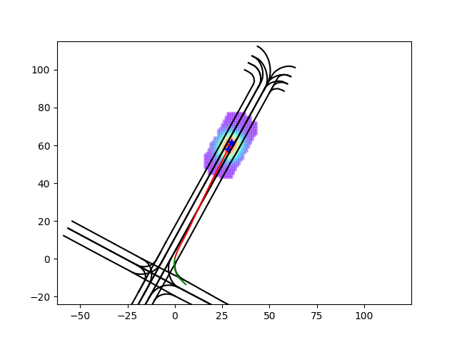

# Using Soft Labels for Goal Prediction

This code is modified from the official implementation of [DenseTNT](https://github.com/Tsinghua-MARS-Lab/DenseTNT).

## Soft Labels for Dense Goals

Inspired by the artificial potential field (APF) approach for path planning, for each goal candidate, we compute the target attraction and reference path attraction based on their distance to the goal candidate. A softmax function is applied to the sum of these "attractive forces" to serve as a soft label for dense goal classification (or retrieval).

**Remark.** The reference path is a polyline crossing through the target and looking similar to the centerline of the closest lane. The distance from a goal candidate to a reference path is computed by the minimum distance from the candidate to a point on the path. By considering attractions from this reference path, we implicitly incorporate the prior knowledge that as long as the model predicts a goal with a similar intention, the trajectory decoder (e.g. Frenet-based) would achieve similar results. In practice, we replace part of the centerline with the ground truth future trajectory, and we use a quadratic curve to fit the reference path:
<p align="center">
  
  
  
</p>

## Train

Use the following command to train (assuming the preprocessed data is saved in ```temp_train.pkl```):

```python train.py --batch_size 64 --num_epochs 50 --lr0 5e-3 --lrf 1e-4 --num_cpus 24 --distributed_training --load_temp_file --temp_file_path "../data/temp_train.pkl"```

**Remark.** The loss displayed during training generally does not indicate the model performance.

To preprocess the argoverse 2 data (assumably under ```./data/train/```), use the following script:

```
from dataset import Dataset

Dataset(load_temp_file=False)
```
